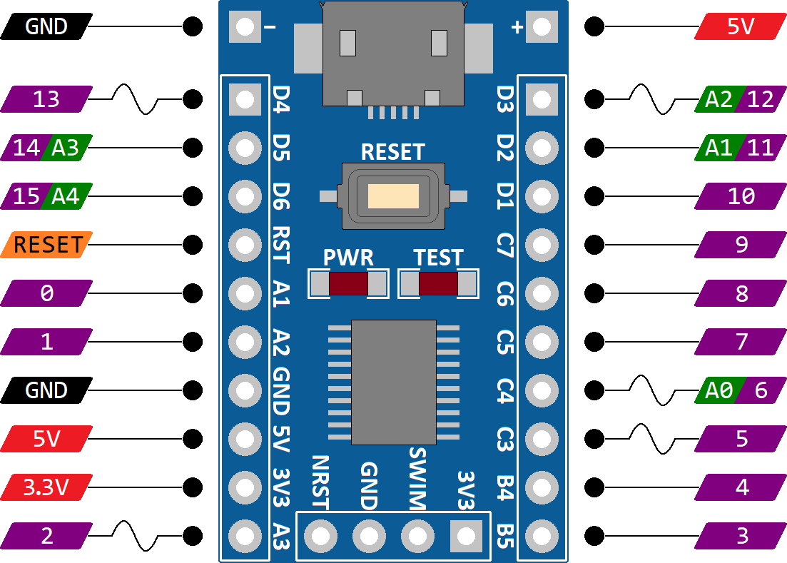

# STM8S103 Template Project

#### Table of Contents

1. [Introduction](#introduction)
1. [Microcontroller Overview](#microcontroller-overview)
1. [Arduino-Style I/O Pins](#arduino-style-io-pins)
1. [Arduino-Style Functions](#arduino-style-functions)
1. [Project Setup](#project-setup)
1. 

## Introduction

The STM8S103F3P6 microcontroller is a very small microcontroller by today's standards. But, it is also very low cost. You can get each [single development board](https://makerfabs.com/Open-Hardware?product_id=265) for around a dollar. The [ST-Link V2 Debugger](https://www.amazon.com/s/?url=search-alias%3Daps&field-keywords=st-link+v2) costs no more than lunch out if you buy in the states.

 

In this project, I created Arduino-style functions that I can use to setup this board for small and simple projects.

## Microcontroller Overview

Here is a quick overview of the features of the STM8S103F3P6 microcontroller development board.
- STM8S103F3P6 microcontroller
    - 8K internal Flash
    - 1K internal RAM
    - 640 bytes internal EEPROM
- Functions developed for the following features
    - 1 UART
    - Up to 16 digital I/O (10 high current sink outputs)
    - Up to 5 analog inputs
    - Up to 5 PWM outputs
- Features without functions developed
    - I2C
    - SPI

## Arduino-Style I/O Pins

| Digital Pin | Analog Pin | PWM Support | Additional Functions | Micro Port/Pin | Unsupported Pin Modes |
|:--:|:--:| :--:| :--:         |:--: | :--: |
|  0 |    |     |              | PA1 | OUTPUT_FAST |
|  1 |    |     |              | PA2 | OUTPUT_FAST |
|  2 |    | PWM |              | PA3 |      |
|  3 |    |     | Test LED I2C SDA | PB5 | OUTPUT OUTPUT_FAST INPUT_PULLUP |
|  4 |    |     | I2C SCL | PB4 | OUTPUT OUTPUT_FAST INPUT_PULLUP |
|  5 |    | PWM |              | PC3 |      |
|  6 | A0 | PWM |              | PC4 |      |
|  7 |    |     | SPI SCK      | PC5 |      |
|  8 |    |     | SPI MOSI     | PC6 |      |
|  9 |    |     | SPI MISO     | PC7 |      |
| 10 |    |     | SWIM (Debug) | PD1 |      |
| 11 | A1 |     |              | PD2 |      |
| 12 | A2 | PWM |              | PD3 |      |
| 13 |    | PWM |              | PD4 |      |
| 14 | A3 |     | Uart Tx      | PD5 |      |
| 15 | A4 |     | Uart Rx      | PD6 |      |

## Arduino-Style Functions

The following Arduino-style functions are implemented through the `libapp0.sm8` library. Therefore, any functions that you don't use will not consume any memory. The `libapp0.sm8` library extends (and replaces) Cosmic's `libm0.sm8` library.

Clicking on the links in the list below will take you to the Arduino documentation. A few functions (marked with numbered superscripts) have slightly different implementations. Those differences are described in the notes after the list.

- Digital I/O
    - [`uint8_t digitalRead(pinType pin)`](https://www.arduino.cc/reference/en/language/functions/digital-io/digitalread/)
    - [`void digitalWrite(pinType pin, uint8_t value)`](https://www.arduino.cc/reference/en/language/functions/digital-io/digitalwrite/)
    - [`void pinMode(pinType pin, modeType mode)`](https://www.arduino.cc/reference/en/language/functions/digital-io/pinmode/)(1)
- Analog I/O
    - [`uint16_t analogRead(uint8_t analogPin)`](https://www.arduino.cc/reference/en/language/functions/analog-io/analogread/)
    - [`void analogWrite(pinType pin, uint8_t dutyCycle)`](https://www.arduino.cc/reference/en/language/functions/analog-io/analogwrite/)
- Advanced I/O
    - [`void noTone(pinType pin)`](https://www.arduino.cc/reference/en/language/functions/advanced-io/notone/)
    - [`int32_t pulseIn(pinType pin, uint8_t value, int32_t timeout)`](https://www.arduino.cc/reference/en/language/functions/advanced-io/pulsein/)(2)
    - [`int32_t pulseInLong(pinType pin, uint8_t value, int32_t timeout)`](https://www.arduino.cc/reference/en/language/functions/advanced-io/pulseinlong/)(2)
    - [`uint8_t shiftIn(pinType dataPin, pinType clockPin, bitOrderType bitOrder)`](https://www.arduino.cc/reference/en/language/functions/advanced-io/shiftin/)
    - [`void shiftOut(pinType dataPin, pinType clockPin, bitOrderType bitOrder, uint8_t value)`](https://www.arduino.cc/reference/en/language/functions/advanced-io/shiftout/)
    - [`void tone(pinType pin, float frequency, uint32_t duration)`](https://www.arduino.cc/reference/en/language/functions/advanced-io/tone/)(3)
- Time
    - [`void delay(uint32_t milliseconds)`](https://www.arduino.cc/reference/en/language/functions/time/delay/)
    - [`void delayMicroseconds(uint16_t microseconds)`](https://www.arduino.cc/reference/en/language/functions/time/delaymicroseconds/)
    - [`uint32_t micros(void)`](https://www.arduino.cc/reference/en/language/functions/time/micros/)
    - [`uint32_t millis(void)`](https://www.arduino.cc/reference/en/language/functions/time/millis/)
- Bits and Bytes
    - [`uint32_t bit(uint8_t bitNumber)`](https://www.arduino.cc/reference/en/language/functions/bits-and-bytes/bit/)
    - [`void bitClear(uint32_t* value, uint8_t bitNumber)`](https://www.arduino.cc/reference/en/language/functions/bits-and-bytes/bitclear/)
    - [`uint8_t bitRead(uint32_t value, uint8_t bitNumber)`](https://www.arduino.cc/reference/en/language/functions/bits-and-bytes/bitread/)
    - [`void bitSet(uint32_t* value, uint8_t bitNumber)`](https://www.arduino.cc/reference/en/language/functions/bits-and-bytes/bitset/)
    - [`void bitWrite(uint32_t* value, uint8_t bitNumber, uint8_t bitValue)`](https://www.arduino.cc/reference/en/language/functions/bits-and-bytes/bitwrite/)
- Communication (Serial)
    - [`int16_t serialAvailable(void)`](https://www.arduino.cc/reference/en/language/functions/communication/serial/available)
    - [`void serialBegin(uint32_t speed, serialConfigType config)`](https://www.arduino.cc/reference/en/language/functions/communication/serial/begin)(4)
    - [`void serialEnd(void)`](https://www.arduino.cc/reference/en/language/functions/communication/serial/end)
    - [`uint8_t serialFind(char* target)`](https://www.arduino.cc/reference/en/language/functions/communication/serial/find)
    - [`uint8_t serialFindUntil(char* target, char* terminal)`](https://www.arduino.cc/reference/en/language/functions/communication/serial/finduntil)
    - [`void serialFlush(void)`](https://www.arduino.cc/reference/en/language/functions/communication/serial/flush)
    - [`int16_t serialPeek(void)`](https://www.arduino.cc/reference/en/language/functions/communication/serial/peek)
    - [`int16_t serialRead(void)`](https://www.arduino.cc/reference/en/language/functions/communication/serial/read)
    - [`int16_t serialReadBytes(char* buffer, uint16_t length)`](https://www.arduino.cc/reference/en/language/functions/communication/serial/readbytes)
    - [`int16_t serialReadBytesUntil(char terminator, char* buffer, uint16_t length)`](https://www.arduino.cc/reference/en/language/functions/communication/serial/readbytesuntil)
    - [`void serialSetTimeout(int32_t milliseconds)`](https://www.arduino.cc/reference/en/language/functions/communication/serial/settimeout)
    - [`int16_t serialWrite(uint8_t val)`](https://www.arduino.cc/reference/en/language/functions/communication/serial/write)(6)
    - [`int16_t serialWriteBuffer(uint8_t* buf, uint16_t len)`](https://www.arduino.cc/reference/en/language/functions/communication/serial/write)(6)
    - [`int16_t serialWriteString(uint8_t* str)`](https://www.arduino.cc/reference/en/language/functions/communication/serial/write)(6)

**NOTES:**
1. This version of pinMode() supports additional modes available on the STM8S103 micro:
    1. Supports the classic Arduino modes INPUT, INPUT_PULLUP, and OUTPUT.
    1. Supports an OUTPUT_FAST mode in which the pins use a higher current and can switch faster. Up to 10MHz instead of the typical 2MHz.
    1. Supports an OUTPUT_OPENDRAIN mode in which the pin can be driven low, but floats when set high. In this mode, there is usually a resistor that pulls the signal high.
2. Both the pulseIn() function and the pulseInLong() function are available by name in the `libapp0.sm8` library. However, they execute the same function.
    1. Resolution: 4 microseconds
    2. Accuracy: +4/-0 microseconds assuming 1) the internal RC oscillator is perfect, 2) no interrupt service routines are changed, and 3) no tone is active.
    2. Minimum pulse width: 4 microseconds
    2. Maximum pulse width: about 35 minutes
3. The tone() function accepts a floating-point number as the frequency.
    1. More accurate generation of the requested frequency.
    3. Less dissonance when attempting to generate musical notes.
4. The serialBegin() function does not accept all serial configuration modes defined by Arduino.
    1. Only accepts: `SERIAL_8N1`, `SERIAL_8N2`, `SERIAL_8E1`, and `SERIAL_8O1`.
5. The C language does not support polymorphism. Therefore, the `Serial.write()` function was split up into three distinct functions:
    1. `serialWrite()` will write a single byte.
    5. `serialWriteBuffer()` will write a buffer of a specified length.
    5. `serialWriteString()` will write the characters in a string. It will not write the terminating null character.
    5. These functions will return immediately (while the first byte is being sent).
    5. `serialWriteBuffer()` and `serialWriteString()` continue to use the buffer that was referenced in the call.
6. Several of the functions from the serial class were not implemented.
    1. `readString()`
    6. `readStringUntil()`
    6. `parseInt()`
    6. `parseFloat()`
7. The `getchar()` and `putchar()` functions were implemented to link the serial port as standard input and standard output.
    1. `char getchar(void)` is a blocking function that eiher gets the next byte on the UART receive queue or waits for the next received byte.
    7. `int putchar(char value)` is a blocking function that waits for the transmit queue to finish transmitting and then transmits the `value`.

## Project Setup

These instructions describe how to use this project for your own development. You will need the following items.

1. Clone the "https://github.com/NFerragut/stm8s103-app.git" GitHub repository.
1. Download and install the free [COSMIC C Compiler for the STM8](http://cosmicsoftware.com/download.php#stm8_free) with no limitations. You must register with COSMIC to download it. I suggest that you install it in the default location so that you don't have to change the makefile that I created.
1. Download and install the free [ST Visual Develop IDE](https://www.st.com/en/development-tools/stvd-stm8.html). You must register with ST to download it.

### Creating Your Own Project

The whole point of this project is to be able to quickly create derivative projects. If you don't need to change the libraries, then you can simply work with the template project.

1. To build the project
    1. Navigate to the `template` directory
    1. Type `make`. If everything works, the project should build. If you have problems, check the Troubleshooting section.
1. To debug the project
    1. Open the ST Visual Develop application
    1. Open the `myApp.stw` workspace in the project folder
    1. Launch the debugger and step through the code

### Customizing the Libraries

The `libdev` folder has everything you need to customize the libraries.

1. To build the project
    1. Navigate to the `libdev` directory
    1. Type `make`. If everything works, the project should build. If you have problems, check the Troubleshooting section.
1. To debug the project
    1. Open the ST Visual Develop application
    1. Open the `app.stw` workspace in the project folder
    1. Launch the debugger and step through the code

### Troubleshooting

1. The `CXLIB` definition in the makefile must reference Cosmic's `CXSTM8/Lib` folder. The build actually copies and augments the libraries provided by Cosmic with our own routines to implement the functions prototyped in `Arduino.h`.

